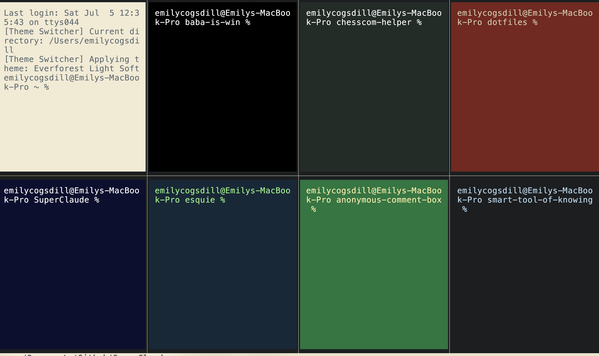

# Dotfiles

Personal configuration files for macOS development environment.

This is how you know I am a serious person!

## Overview

This repository contains my personal configurations for:
- **[Kitty Terminal](https://sw.kovidgoyal.net/kitty/)** - GPU-accelerated terminal with automatic theme switching
- **[AeroSpace](https://github.com/nikitabobko/AeroSpace)** - Tiling window manager for macOS

## Prerequisites

- macOS (tested on Darwin 24.5.0)
- [Homebrew](https://brew.sh/)
- Git

## Quick Start

1. Clone the repository:
```bash
git clone https://github.com/emilycogsdill/dotfiles.git
cd dotfiles
```

2. Apply configurations:
```bash
make kitty   # Install Kitty configuration
make aero    # Install AeroSpace configuration
```

To import configurations from your system back to the repo:
```bash
make kitty ACTION=import
make aero ACTION=import
```

## Repository Structure

```
├── .project/         # Project documentation
├── aerospace/       # AeroSpace window manager config
├── kitty/           # Kitty terminal config
│   ├── theme-mappings.json         # Theme-to-directory mappings
│   ├── theme-mappings-private.json # Private project mappings (gitignored)
│   ├── theme-switcher.sh          # Automatic theme switcher
│   └── themes/                    # Color theme collection
└── Makefile         # Configuration management
```

## Features

### Kitty Terminal
- **Automatic Theme Switching**: Changes terminal colors based on current directory
  - Configure in `theme-mappings.json` (public projects)
  - Use `theme-mappings-private.json` for work projects



### AeroSpace Window Manager
- **Tiling Layouts**: Automatic window arrangement
- **Workspace Management**: 10+ workspaces with quick switching
- **Dvorak-Friendly (true gamers only)**: Alt + d/h/t/n for navigation (left/down/up/right)

## Theme Configuration

Edit `kitty/theme-mappings.json` to customize which theme applies to which directory:

```json
{
  "mappings": [
    {
      "pattern": "*dotfiles*",
      "theme": "Red Sands"
    },
    {
      "path": "$HOME",
      "theme": "Nightfly"
    }
  ]
}
```

## License

Personal configuration files provided as-is for reference and #inspiration.
